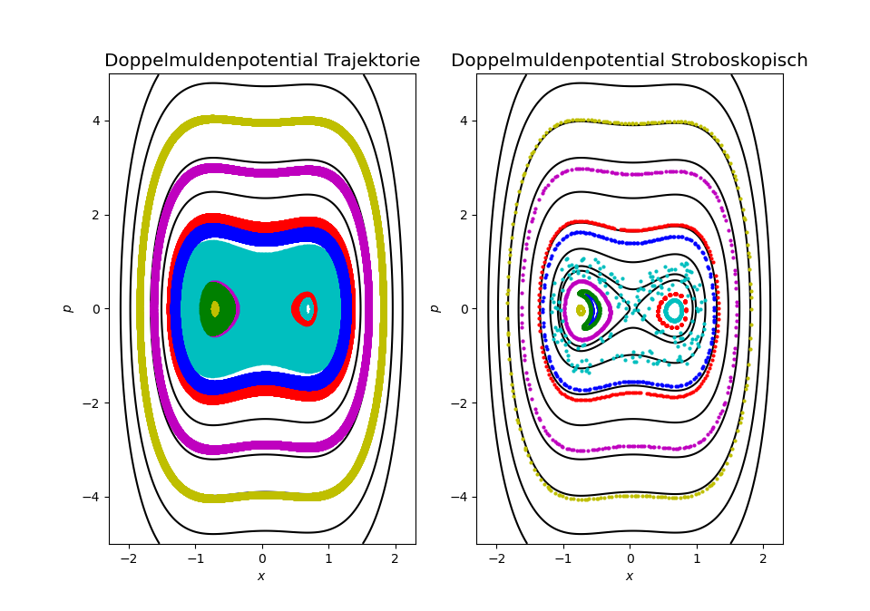

# ComputationalPhysics2016
 My personal results derived from the 2016 tasks in computational physics 

## Computational Physics Task 1.1
Standard map of the 'Kicked Rotor'


## Computational Physics Task 2.1
Elementary numerical methods I

 using three different methods")

## Computational Physics Task 3.1
Elementary numerical methods II

 using three different methods")

## Computational Physics Task 4.1
Dynamics of a particle in the driven double trough potential.
V(x) = x^4 - x^2 + x[A + B*sin(w*t)]



## Computational Physics Task 5.1
Elementary numerical methods I

 using three different methods")

## Computational Physics Task 6.1
Elementary numerical methods I

 using three different methods")

## Computational Physics Task 7.1
Elementary numerical methods I

 using three different methods")

## Computational Physics Task 8.1
Elementary numerical methods I

 using three different methods")

## Computational Physics Task 9.1
Elementary numerical methods I

 using three different methods")

## Computational Physics Task 10.1
Elementary numerical methods I

 using three different methods")

## Install:
With [Conda](https://docs.conda.io/en/latest/) on the system installed the dependencies for this project can be automatically installed in a new environment:

Go to the projects base directory.

Open a *conda-command-prompt* with admin privileges and run the commands from the project folder
- to create a new environment with basic dependencies:
```shell
conda env create -f .\environment.yml
```
- to activate the environment:
```shell
conda activate compphys2016
```

## How to use

With everything installed it comes down to running with the respective shell active just
```shell
python .\1_1_martin_roebke.py
```


# Report problems
Check if the above steps are properly done.

If yes and there is something to be done - log into github and look at [Issues](https://github.com/VaeterchenFrost/ComputationalPhysics2016/issues) (or [open new](https://github.com/VaeterchenFrost/ComputationalPhysics2016/issues/new/choose))  - 
or contact the maintainer ;-)